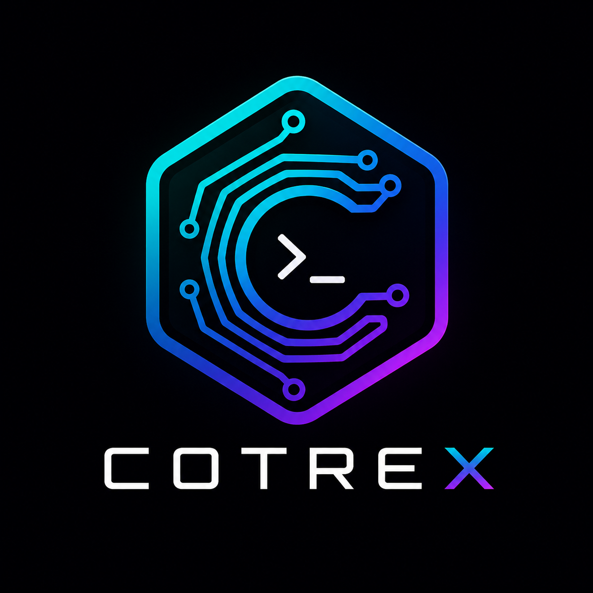

<p align="center">
  
</p>

<p align="center">
  <strong>A deterministic RTK orchestration layer that normalizes agent intent and stream output — without owning execution</strong>
</p>

<p align="center">
  
  
  
  
  
  
  
</p>

<p align="center">
  <a href="#what-is-cotrex">About</a> &bull;
  <a href="#installation">Install</a> &bull;
  <a href="#usage">Usage</a> &bull;
  <a href="CLAUDE.md">Architecture</a> &bull;
  <a href="#roadmap">Roadmap</a>
</p>

---

## What is Cotrex

Cotrex sits between an AI agent and the system. It takes an agent's
**intent**, forwards it to [RTK](https://github.com/rtk-ai/rtk) — the execution truth layer — and
returns a **normalized, dual-channel** result. Cotrex never runs a raw command itself; it invokes
`rtk <subcommand>` and tags what RTK emits.

- **Machine channel** (`stdout`): newline-delimited JSON, one event per line.
- **Human channel** (`stderr`): a short readable summary.

This keeps the model's input structured and small while a human still gets a glanceable trace.

## How it works

```
agent intent  ──▶  parse  ──▶  map to rtk  ──▶  spawn rtk  ──▶  classify lines  ──▶  dual output
 (CLI | JSON)      Intent     first token →     2 threads        severity for       stdout: raw lines
                              rtk subcommand     + mpsc           error count        + result footer
                                                                                     stderr: summary
```

The command's first token picks the RTK invocation: a known tool (`git`, `cargo`, `npm`, ...) routes
to that dedicated rtk filter (`cargo test` → `rtk cargo test`); anything else falls back to
`rtk run -c "<command>"`.

## Installation

Cotrex ships as a **single binary** — RTK is embedded inside it. No separate installation needed.

### Install with your agent

Paste this to Claude Code / Cursor / Codex:

```text
Download and run the Cotrex install script for my platform:
- macOS/Linux: curl -sL https://raw.githubusercontent.com/pamod-madubashana/Cotrex/main/Scripts/install.sh | bash
- Windows PowerShell: irm https://raw.githubusercontent.com/pamod-madubashana/Cotrex/main/Scripts/install.ps1 | iex
Then confirm with `cotrex --version`.
```

### Quick install (recommended)

Run the install script for your platform:

| Platform | Command |
|----------|---------|
| **macOS / Linux** | `curl -sL https://raw.githubusercontent.com/pamod-madubashana/Cotrex/main/Scripts/install.sh \| bash` |
| **Windows (PowerShell)** | `irm https://raw.githubusercontent.com/pamod-madubashana/Cotrex/main/Scripts/install.ps1 \| iex` |
| **Windows (double-click)** | Download [`Scripts/install.cmd`](Scripts/install.cmd) and run it |

Or download the install script from `Scripts/` and run it:

```bash
# macOS/Linux
bash Scripts/install.sh

# Windows (PowerShell)
.\Scripts\install.ps1

# Windows (double-click)
Scripts\install.cmd
```

### Manual install

1. Download the archive for your platform from [Releases](https://github.com/pamod-madubashana/Cotrex/releases/latest)
2. Extract `cotrex`
3. Put it on your `PATH`
4. Run `cotrex --version`

### Build from source

Needs a Rust toolchain. RTK must be built first so it can be embedded:

```bash
git clone --recursive https://github.com/pamod-madubashana/Cotrex
cd Cotrex
cargo build --release --bin rtk   # build RTK first
cargo build --release             # build cotrex with embedded RTK
```

## Usage

### Run a command through RTK

```bash
cotrex run "git status"
cotrex git status        # same thing — the run subcommand is optional
```

```jsonc
// stdout (machine): rtk output verbatim, then one result footer
 M src/orchestrate.rs
{"type":"result","status":"ok","code":0}
```
```text
# stderr (human)
› rtk git status
‹ ok (exit 0, 0 error line(s))
```

Shell operators are supported — they route through the system shell automatically:

```bash
cotrex run "git add . && git commit -m 'fix: thing'"
cotrex run "cargo test || echo 'tests failed'"
```

### JSON intent (pipe)

```bash
echo '{"tool":"rtk","cmd":"cargo --version"}' | cotrex
```

### LLM compression (opt-in)

```bash
cotrex run --llm "cargo test"
```

```jsonc
// after the normal lines + result, one extra event:
{"type":"insight","status":"failed","root_cause":"missing crate serde_json",
 "important_errors":["cannot find crate `serde_json`"],"suggested_fix":"add serde_json to Cargo.toml"}
```

Needs an API key configured via `cotrex setup`. Without `--llm`, no key is read.

### Prompts (single quoted arg)

```bash
cotrex "list all rust projects in the current dir"       # runs find/sed, prints the list
cotrex "what does the ? operator do?"                    # answers (rendered markdown)
cotrex "plan-stack: build a music player app"            # structured answer
```

`cotrex "..."` is interactive (spinner, live stream, rendered output).
`cotrex -m "..."` is machine mode (raw text, no spinner, for agent-to-agent).

### Roles (offload to a role-specific model)

```bash
cotrex planner "plan releasing this crate to crates.io"
cotrex coder "write a Rust fn that reverses a string"
cotrex orchestrator "build the release artifacts"
```

### Install skills for your agent

```bash
cotrex install opencode    # install skills for OpenCode
cotrex install claude      # install skills for Claude Code
cotrex install codex       # install skills for Codex
cotrex install cursor      # install skills for Cursor
```

Supported agents: `opencode`, `claude`, `codex`, `cursor`, `gemini`, `windsurf`, `aider`, `continue`, `cline`.

## Setup (provider, API key, modes)

```bash
cotrex setup
```

Prompts for:
- **Provider** — Groq, OpenRouter, NVIDIA NIM, or Custom
- **API key** — masked input
- **Compression** — `heuristic` (default) · `llm` · `off`
- **RTK output** — `normal` or `ultra-compact`

Settings written to OS config dir. `COTREX_LLM_URL`/`_KEY`/`_MODEL` env vars override.

## MCP server (primary interface for agents)

```bash
cotrex mcp        # JSON-RPC 2.0 over stdio
```

```json
{
  "mcpServers": {
    "cotrex": { "command": "cotrex", "args": ["mcp"] }
  }
}
```

Tools: `run`, `delegate`, `plan`, `list_roles`, `set_agent`.

## Development

```bash
cargo build --release --bin rtk   # build RTK first
cargo build --release             # build cotrex with embedded RTK
cargo test                        # run tests
```

See [CLAUDE.md](CLAUDE.md) for architecture and contributor rules.

## Roadmap

- **Graphify integration** — auto-refresh code map after code-changing runs
- **Multi-agent orchestration** — coordinate multiple agents on complex tasks

## License

[MIT](LICENSE)
